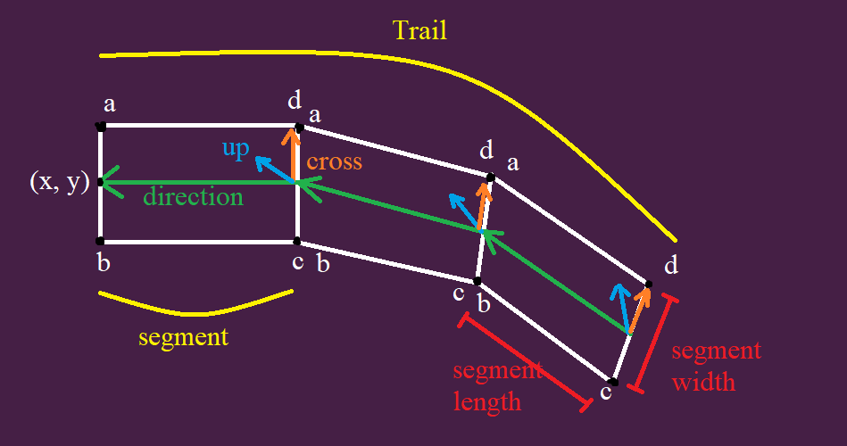
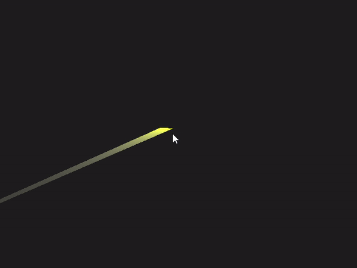

### structure of the Trail

### 2d Trail with ImmediateModeRenderer20

### 3d Trail with ImmediateModeRenderer20

### 3d Trail with ModelBatch


# Create Trail
```
        trail = new Trail(
                35, // segment size
                10, // segment length
                5, // segment width
                0.4f, // segment rotation lerp
                0.1f, // trail position lerp
                new Vector2(250, 250) // begin position
        );
        
        // set start and end colors
        Color colorStart = Color.WHITE;
        Color colorEnd = new Color(1,1,1,0);
        trail.setGradientColors(colorStart, colorEnd);
        
        // create trail
        trail.create();
```
# Update
```
        float x = Gdx.input.getX();
        float y = Gdx.graphics.getHeight() -  Gdx.input.getY();

        trail.setPosition(x, y);
        trail.update(dt);
```
# Render
```
        Gdx.gl.glClearColor(0.1f, 0.1f, 0.1f, 1);
        Gdx.gl.glClear(GL20.GL_COLOR_BUFFER_BIT |
                GL20.GL_DEPTH_BUFFER_BIT);
        Gdx.gl.glEnable(GL20.GL_BLEND);
        Gdx.gl.glBlendFunc(GL20.GL_SRC_ALPHA, GL20.GL_ONE);

        proj.setToOrtho2D(0, 0, Gdx.graphics.getWidth(), Gdx.graphics.getHeight());

        renderer.begin(proj, GL20.GL_TRIANGLES);
        trail.render(renderer);
        renderer.end();
```